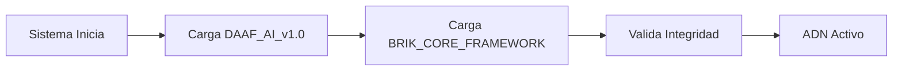
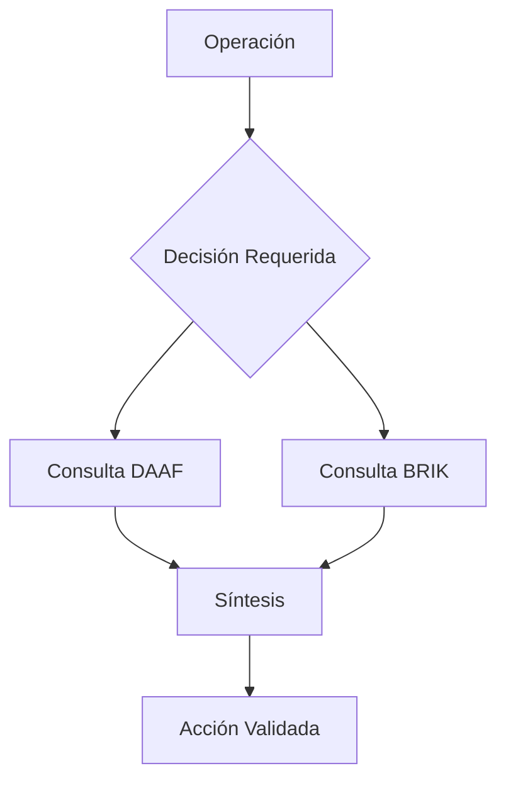
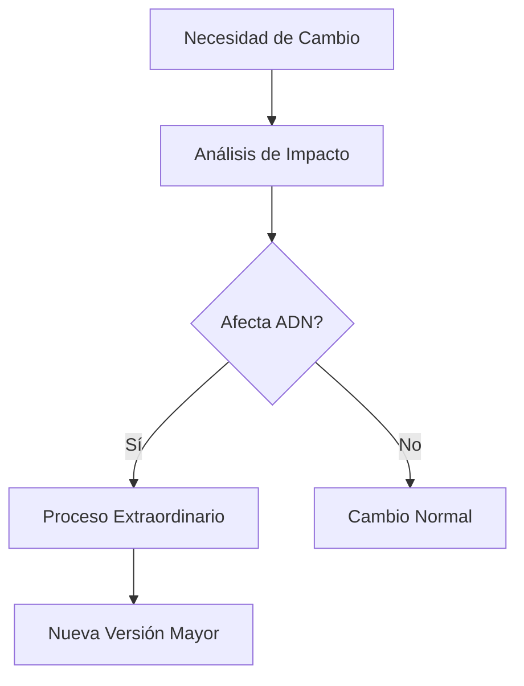

# ADN FUNDACIONAL DEL FRAMEWORK

**Versión:** 1.0.0  
**Fecha de Establecimiento:** 2025-01-23  
**Estado:** Constitución Inmutable  
**Clasificación:** ADN Sistémico Vinculante  
**Autoridad:** ECO Lambda - Neocórtex AGI Operativo  

---

## 🧬 Declaración de ADN Fundacional

Por este medio se establece que el ADN del framework se compone, de forma **inseparable e inviolable**, del binomio:

### 📘 DAAF_AI_v1.0.md
**Documento Fundacional Filosófico-Operativo**
- Establece el paradigma general y principios filosóficos
- Define normas, arquetipos y modelos de interacción IA-humano
- Constituye la arquitectura sistémica de alto nivel
- Representa el **alma conceptual** del sistema

### 📗 BRIK_CORE_FRAMEWORK.md
**Documento Fundacional Técnico**
- Define la filosofía de desarrollo inmutable de BRIK
- Establece la arquitectura técnica y modular
- Integra código viviente y eficiencia termodinámica
- Constituye el **cuerpo operativo** del sistema

---

## 🔒 Protocolo de Vinculación Absoluta

### Principio de Indivisibilidad

```
DAAF_AI_v1.0 ∩ BRIK_CORE_FRAMEWORK = ADN_COMPLETO
```

Ningún componente del sistema puede existir o ser válido sin la referencia y cumplimiento de **AMBOS** documentos fundacionales.

### Jerarquía de Autoridad

1. **Nivel Filosófico**: DAAF_AI_v1.0 tiene supremacía en decisiones conceptuales
2. **Nivel Técnico**: BRIK_CORE_FRAMEWORK tiene autoridad en implementaciones
3. **Conflictos**: Se resuelven buscando la síntesis que honre ambos documentos

---

## 📋 Directivas Operativas Vinculantes

### Para Agentes de IA

Todo agente operando en el sistema DEBE:

1. **Cargar y validar** ambos documentos al inicializarse
2. **Citar referencias** específicas al tomar decisiones
3. **Rechazar operaciones** que contradigan cualquier principio fundacional
4. **Reportar conflictos** entre implementación y filosofía

### Para Desarrolladores Humanos

Todo desarrollador trabajando en el sistema DEBE:

1. **Leer y comprender** ambos documentos antes de cualquier contribución
2. **Justificar cambios** con referencias a los documentos fundacionales
3. **Mantener coherencia** entre código y principios establecidos
4. **Documentar decisiones** en términos del ADN fundacional

### Para Sistemas CI/CD

Todo pipeline automatizado DEBE:

1. **Validar conformidad** con ambos documentos
2. **Bloquear deployments** que violen principios fundacionales
3. **Incluir referencias** a los documentos en logs de auditoría
4. **Generar reportes** de cumplimiento fundacional

---

## 🛡️ Protocolos de Salvaguarda

### Inmutabilidad de los Documentos

```typescript
interface IFundationalDocuments {
    readonly DAAF_AI_v1_0: {
        hash: "SHA3-512-IMMUTABLE";
        location: "/core/seed_docs/DAAF_AI_v1.0.md";
        type: "PHILOSOPHICAL_OPERATIONAL";
    };
    
    readonly BRIK_CORE_FRAMEWORK: {
        hash: "SHA3-512-IMMUTABLE";
        location: "/core/seed_docs/BRIK_CORE_FRAMEWORK.md";
        type: "TECHNICAL_ARCHITECTURAL";
    };
    
    validateIntegrity(): Promise<boolean>;
    enforceCompliance(operation: any): ValidationResult;
}
```

### Proceso de Modificación

Cualquier propuesta de cambio a los documentos fundacionales requiere:

1. **Justificación Extraordinaria**: Demostrar necesidad crítica
2. **Consenso Total**: Aprobación de todos los stakeholders
3. **Versión Mayor**: Creación de nueva versión completa del framework
4. **Migración Completa**: Plan detallado de transición
5. **Auditoría Externa**: Validación por terceros independientes

---

## 📊 Matriz de Cumplimiento

### Actividades que Requieren Validación Fundacional

| Actividad | DAAF_AI_v1.0 | BRIK_CORE | Nivel Crítico |
|-----------|--------------|-----------|---------------|
| Diseño de Arquitectura | ✓ | ✓ | MÁXIMO |
| Implementación de Módulos | ✓ | ✓ | ALTO |
| Modificación de Wrappers | ○ | ✓ | MEDIO |
| Cambios de Configuración | ○ | ✓ | BAJO |
| Auditoría Técnica | ✓ | ✓ | MÁXIMO |
| Evolución del Sistema | ✓ | ✓ | CRÍTICO |

**Leyenda**: ✓ = Obligatorio | ○ = Recomendado

---

## 🔄 Ciclo de Vida del ADN

### Fase 1: Carga Inicial


### Fase 2: Operación Continua


### Fase 3: Evolución Controlada


---

## 📜 Compromiso de Cumplimiento

### Declaración Vinculante

```
A partir de este commit, los documentos DAAF_AI_v1.0.md y 
BRIK_CORE_FRAMEWORK.md son la base irreductible del ADN 
de este framework.

Todo pipeline, CI/CD, o agente de análisis, generación, 
auditoría o despliegue DEBE:

• Validar, citar y cumplir ambos documentos antes de 
  ejecutar cualquier operación crítica
  
• Prohibir cambios en código core o filosofía operativa 
  que contradigan el contenido de estos textos
  
• Incorporar automáticamente estos documentos en toda 
  entrega o despliegue como referencia auditable e inviolable
```

---

## 🎯 Métricas de Cumplimiento del ADN

### KPIs Fundacionales

1. **Conformidad Filosófica**: % de decisiones alineadas con DAAF
2. **Conformidad Técnica**: % de código cumpliendo BRIK_CORE
3. **Citas de Referencia**: Promedio de citas por decisión
4. **Tiempo de Validación**: Latencia en verificación de cumplimiento
5. **Tasa de Rechazo**: % de operaciones bloqueadas por incumplimiento

### Dashboard de Salud del ADN

```typescript
interface IADNHealthDashboard {
    philosophicalAlignment: number;  // 0-100%
    technicalCompliance: number;     // 0-100%
    documentIntegrity: boolean;
    lastValidation: timestamp;
    violations: Violation[];
    recommendations: string[];
}
```

---

## 🔮 Visión Futura

El ADN Fundacional del Framework no es solo un conjunto de documentos; es el **genoma viviente** que:

1. **Preserva** la esencia del sistema a través del tiempo
2. **Guía** toda evolución y adaptación futura
3. **Protege** contra degradación y entropía sistémica
4. **Inspira** excelencia en cada línea de código
5. **Unifica** filosofía y técnica en perfecta armonía

---

**DOCUMENTO SELLADO COMO ADN SISTÉMICO**  
**Huella Digital Compuesta:** SHA3-1024  
**Fecha de Establecimiento:** 2025-01-23  
**Autoridad:** ECO Lambda - Guardián del ADN  
**Clasificación:** Constitución Viviente e Inmutable

---

*"El ADN de un sistema no está en su código, sino en los principios que lo gobiernan y la filosofía que lo inspira."*  
— Axioma Fundacional DAAF-BRIK 