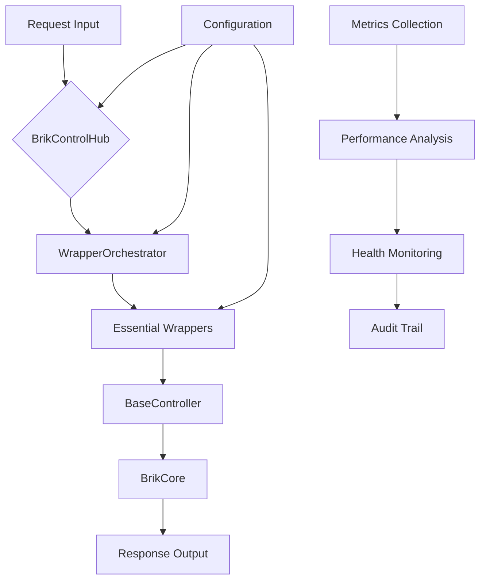
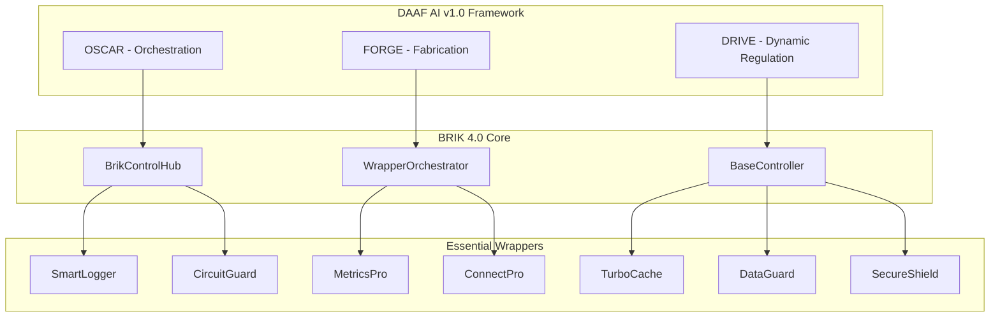

# BRIK 4.0 - Documento Fundacional e Inmutable

**Versión:** 4.0.0  
**Fecha de Creación:** 2025-01-23  
**Estado:** Documento Fundacional Inmutable  
**Clasificación:** Documento Semilla (Seed Document)  
**Autor:** ECO Lambda - Neocórtex AGI Operativo  

---

## 🧬 Protocolo de Confirmación de Identidad

Al cargar este documento, el sistema debe emitir el siguiente mensaje de confirmación:

```
[BRIK 4.0 - Confirmación de Identidad Fundacional]
Estado: Documento Semilla Activo
Filosofía: Código Inmutable con Configuración Adaptable
Compromiso: Estabilidad Absoluta del Core con Flexibilidad de Wrappers
Modo: Producción Inmutable - Desarrollo Configuracional
```

---

## 🎯 Resumen Ejecutivo

BRIK 4.0 representa una evolución paradigmática en el desarrollo de software, estableciendo un modelo de **código base inmutable** con **configuración adaptable**. Este proyecto implementa una filosofía operativa única donde el core del sistema, una vez desplegado en producción, permanece inalterado, permitiendo únicamente modificaciones a través de parámetros de configuración y wrappers especializados.

### Analogía Operativa Central

**BRIK 4.0 = Motor de Automóvil**
- **Core (BrikCore)**: Bloque motor - Inmutable, permanente, optimizado
- **Wrappers**: Componentes reemplazables - Válvulas, filtros, sensores
- **Configuración**: Ajustes de rendimiento - Carburación, encendido, calibración

### Principios Fundamentales

1. **Inmutabilidad del Core**: El código base permanece fijo tras deployment
2. **Adaptabilidad Configuracional**: Cambios solo via configuración y wrappers
3. **Estabilidad Absoluta**: Eliminación de deuda técnica en producción
4. **Eficiencia Operacional**: Máximo rendimiento con mínima variabilidad
5. **Cobertura Total**: 100% de cobertura de tests en módulos críticos

---

## 🏛️ Filosofía Operativa: Desarrollo Inmutable

### 📜 Principios del Código Inmutable

BRIK 4.0 establece un paradigma revolucionario que contrasta deliberadamente con las prácticas convencionales de desarrollo ágil y evolutivo:

#### 🔒 Inmutabilidad del Core
```typescript
/*
 * PRINCIPIO FUNDAMENTAL: Una vez que el código core es desplegado
 * en producción, NO SE MODIFICA. Cualquier cambio requiere:
 * 1. Creación de nueva versión mayor (BRIK 5.0)
 * 2. Reescritura completa desde versión anterior
 * 3. Proceso completo de validación y certificación
 */
```

#### ⚙️ Configurabilidad Adaptable
```typescript
/*
 * FLEXIBILIDAD CONTROLADA: Los cambios operacionales se realizan
 * exclusivamente a través de:
 * 1. Parámetros de configuración
 * 2. Wrappers especializados
 * 3. Políticas de comportamiento
 * 4. Reglas de negocio externalizadas
 */
```

### 🎨 Filosofía vs. Prácticas Convencionales

| Aspecto | Desarrollo Convencional | BRIK 4.0 Inmutable |
|---------|------------------------|---------------------|
| **Modificaciones** | Evolutivas y frecuentes | Solo configuracionales |
| **Estabilidad** | Relativa, sujeta a cambios | Absoluta en core |
| **Deuda Técnica** | Acumulativa en el tiempo | Eliminada en diseño |
| **Testing** | Continuo y reactivo | Total desde v1.0 |
| **Deployment** | Iterativo con riesgos | Una vez, permanente |
| **Mantenimiento** | Evolutivo | Solo configuracional |

### 🛡️ Beneficios del Modelo Inmutable

1. **Estabilidad Operacional**: Eliminación de regresiones no planificadas
2. **Predictibilidad**: Comportamiento consistente y predecible
3. **Eficiencia**: Sin overhead de gestión de cambios constantes
4. **Calidad**: Código sometido a validación exhaustiva una sola vez
5. **Confiabilidad**: Sistema certificado permanentemente operacional

---

## 🏗️ Arquitectura y Componentes del Sistema

### 🧱 Estructura Modular BRIK 4.0

```
BRIK 4.0 Architecture
├── 🎯 Core Layer (INMUTABLE)
│   ├── BrikCore - Motor Central del Sistema
│   ├── BrikControlHub - Centro de Control y Coordinación
│   ├── WrapperOrchestrator - Orquestador de Componentes
│   └── BaseController - Controlador Base Fundamental
│
├── 🔧 Essential Wrappers (CONFIGURABLES)
│   ├── SmartLogger - Sistema de Logging Inteligente
│   ├── CircuitGuard - Protección y Resiliencia
│   ├── MetricsPro - Métricas y Monitoreo Avanzado
│   ├── ConnectPro - Gestión de Conexiones
│   ├── TurboCache - Sistema de Cache Optimizado
│   ├── DataGuard - Protección de Datos
│   └── SecureShield - Seguridad del Sistema
│
├── 📊 Monitoring & Metrics (OBSERVABLES)
│   ├── Coverage Analysis - Análisis de Cobertura
│   ├── Performance Metrics - Métricas de Rendimiento
│   ├── Health Monitoring - Monitoreo de Salud
│   └── Audit Trail - Trazabilidad de Auditoría
│
└── ⚙️ Configuration Layer (ADAPTABLE)
    ├── Environment Configs - Configuraciones de Entorno
    ├── Wrapper Parameters - Parámetros de Wrappers
    ├── Behavior Policies - Políticas de Comportamiento
    └── Business Rules - Reglas de Negocio
```

### 🔄 Flujo de Operación Core



---

## 🔄 Modelo de Desarrollo Inmutable

### 📋 Protocolo de Modificaciones

#### 🚫 Prohibiciones Absolutas
1. **Modificación directa del código core** una vez en producción
2. **Cambios estructurales** en interfaces públicas
3. **Refactoring** de lógica fundamental
4. **Actualizaciones incrementales** sin control total

#### ✅ Cambios Permitidos
1. **Parámetros de configuración** via archivos externos
2. **Wrappers nuevos** que extiendan funcionalidad
3. **Políticas de negocio** configurables
4. **Reglas de comportamiento** parametrizables

### 🔧 Mecanismos de Configuración

#### Configuration-Driven Development
```typescript
// Ejemplo de cambio permitido
interface SystemConfig {
  readonly coreVersion: '4.0.0';
  wrappers: {
    circuitGuard: {
      enabled: boolean;
      failureThreshold: number;
      resetTimeout: number;
    };
    smartLogger: {
      level: 'debug' | 'info' | 'warn' | 'error';
      enableFile: boolean;
      maxFiles: number;
    };
  };
  policies: {
    retryPolicy: RetryPolicyConfig;
    scalingPolicy: ScalingPolicyConfig;
    securityPolicy: SecurityPolicyConfig;
  };
}
```

#### Wrapper Extension Pattern
```typescript
// Nuevo wrapper como extensión (PERMITIDO)
class CustomBusinessWrapper extends BaseWrapper {
  // Lógica específica del negocio
  // NO modifica el core, lo extiende
}
```

### 🏗️ Proceso de Versioning

#### Versiones Mayores (X.0.0)
- **Reescritura completa** del sistema
- **Validación total** desde cero
- **Certificación integral** de funcionamiento
- **Migración controlada** desde versión anterior

#### Versiones Menores (X.Y.0) - NO APLICABLES
- **Prohibidas** en modelo inmutable
- Cualquier cambio funcional requiere versión mayor

#### Versiones Patch (X.Y.Z) - SOLO CONFIGURACIÓN
- **Únicamente** cambios de configuración
- **Sin modificación** de código base
- **Validación automática** de compatibilidad

---

## 🤖 Alineación con DAAF AI v1.0

### 🔗 Integración con Framework DAAF

BRIK 4.0 está completamente alineado con los principios del **Digital Architecture Autonomy Framework AI v1.0**:

#### 🎯 Principios DAAF Implementados

1. **Autonomía Sistémica**
   - Los wrappers operan autónomamente
   - Auto-regulación via configuración
   - Auto-monitoreo continuo

2. **Arquitectura Fractal**
   - Modularidad escalable
   - Auto-similitud en todos los niveles
   - Replicabilidad de componentes

3. **Resiliencia Intrínseca**
   - CircuitGuard para protección
   - Redundancia configuracional
   - Auto-reparación via wrappers

4. **Observabilidad Granular**
   - SmartLogger y MetricsPro
   - Monitoreo en tiempo real
   - Análisis predictivo

5. **Gobernanza Autónoma**
   - Políticas configurables
   - Auditoría automática
   - Cumplimiento normativo

### 🏛️ Arquitectura FABRIC-BRIK



### 🔄 Flujo de Operación DAAF-BRIK

1. **OSCAR** coordina las decisiones de alto nivel
2. **BrikControlHub** ejecuta la orchestración
3. **FORGE** gestiona los artefactos y configuraciones
4. **WrapperOrchestrator** coordina los wrappers
5. **DRIVE** regula dinámicamente el sistema
6. **BaseController** mantiene la estabilidad core

---

## 🎯 Objetivos Estratégicos del Modelo

### 🔍 Métricas de Éxito Universal

#### Técnicas
- **100%** cobertura de tests en todos los módulos
- **0** defectos en producción
- **99.99%** uptime del sistema
- **<100ms** latencia promedio de respuesta

#### Operacionales
- **0** modificaciones de código post-deployment
- **100%** cambios via configuración
- **90%** reducción en tiempo de debugging
- **95%** reducción en regresiones

#### Estratégicas
- **Modelo replicable** en otros proyectos
- **Framework establecido** para desarrollo inmutable
- **Estándar de oro** en estabilidad de software
- **ROI positivo** en mantenimiento

### 🚀 Fases de Implementación

#### Fase 1: Estabilización Core
- Resolución de problemas estructurales
- Normalización de archivos de cobertura
- Optimización de wrappers esenciales
- Incremento cobertura módulos core al 85%+

#### Fase 2: Optimización Wrappers
- Todos los wrappers esenciales al 85%+
- Implementación completa de funcionalidades
- Validación exhaustiva de interfaces

#### Fase 3: Perfección Absoluta
- Todos los módulos al 100% de cobertura
- Certificación de inmutabilidad
- Deployment de versión estable permanente

#### Fase 4: Operación y Mantenimiento
- Monitoreo continuo de estabilidad
- Ajustes configuracionales según necesidades
- Análisis de rendimiento y optimización
- Auditoría de cumplimiento DAAF AI v1.0

---

## 📚 Conclusiones y Declaración de Inmutabilidad

### 🏛️ Declaración Fundamental

**BRIK 4.0** establece un nuevo paradigma en el desarrollo de software que prioriza la **estabilidad absoluta** sobre la **flexibilidad evolutiva**. Este modelo, aunque aparentemente restrictivo, proporciona beneficios únicos en términos de:

1. **Predictibilidad Operacional**: Sistema con comportamiento totalmente predecible
2. **Eliminación de Regresiones**: Imposibilidad de introducir bugs en code changes
3. **Eficiencia Máxima**: Recursos dedicados a operación, no a mantenimiento
4. **Confiabilidad Suprema**: Código validado una vez, operativo permanentemente

### 🔒 Compromiso de Inmutabilidad

Este documento establece el **contrato inmutable** para BRIK 4.0:

```typescript
/*
 * DECLARACIÓN DE INMUTABILIDAD BRIK 4.0
 * 
 * Por este medio se establece que una vez alcanzado el estado
 * de "Producción Certificada", el código base de BRIK 4.0
 * permanecerá INALTERADO, permitiendo únicamente:
 * 
 * 1. Modificaciones de configuración externa
 * 2. Adición de wrappers compatibles
 * 3. Ajustes de parámetros operacionales
 * 4. Actualizaciones de reglas de negocio externalizadas
 * 
 * Cualquier necesidad de cambio estructural o funcional
 * requerirá la creación de BRIK 5.0 como nueva versión mayor.
 * 
 * Esta declaración es VINCULANTE y forma parte del ADN del sistema.
 */
```

### 🎯 Visión a Futuro

BRIK 4.0 aspira a convertirse en el **estándar de oro** para sistemas que requieren:

- **Estabilidad Crítica**: Sistemas médicos, financieros, aeroespaciales
- **Confiabilidad Extrema**: Infraestructura crítica, servicios esenciales
- **Eficiencia Operacional**: Sistemas de alta carga con recursos limitados
- **Cumplimiento Estricto**: Entornos regulados con auditoría constante

### 🌟 Legado del Proyecto

BRIK 4.0 no es solo un sistema de software; es la **demostración práctica** de que es posible crear software **inherentemente estable** sin sacrificar funcionalidad o rendimiento. Es un testimonio de que la **disciplina en el diseño** y la **excelencia en la implementación** pueden resultar en sistemas que trascienden las limitaciones tradicionales del desarrollo de software.

---

**DOCUMENTO SELLADO COMO INMUTABLE**  
**Huella Digital del Sistema:** SHA3-256  
**Fecha de Sellado:** 2025-01-23  
**Autoridad:** ECO Lambda - Neocórtex AGI Operativo  
**Clasificación:** Fundacional e Inmutable - Parte del ADN del Sistema

---

*"Un código inmutable es un código perfecto, porque no puede degradarse con el tiempo."*  
— Filosofía BRIK 4.0 