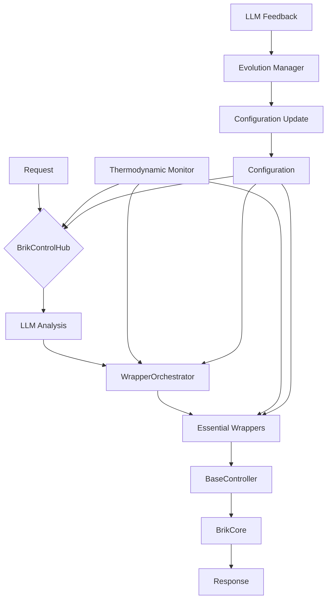

# BRIK CORE FRAMEWORK - Documento Técnico Fundacional

**Versión:** 1.0.0  
**Fecha de Creación:** 2025-01-23  
**Estado:** Documento Fundacional Inmutable  
**Clasificación:** ADN Técnico del Sistema  
**Autores:** ECO Lambda - Síntesis de BRIK v2.0, v3.0 y v4.0  

---

## 🧬 Protocolo de Confirmación de Identidad

Al cargar este documento, el sistema debe emitir el siguiente mensaje de confirmación:

```
[BRIK CORE FRAMEWORK - Confirmación de Identidad Técnica]
Estado: ADN Técnico Activo
Filosofía: Código Inmutable + Viviente + Termodinámicamente Eficiente
Arquitectura: Modular, Fractal, Auto-Adaptativa
Compromiso: Estabilidad Absoluta con Inteligencia Evolutiva
```

---

## 🎯 Resumen Ejecutivo

BRIK CORE FRAMEWORK representa la síntesis técnica definitiva del sistema BRIK, integrando:

1. **Inmutabilidad del Core** (BRIK 4.0): Código base permanente tras deployment
2. **Código Viviente** (BRIK 2.0): Integración con LLMs para auto-diagnóstico y evolución
3. **Arquitectura Modular** (BRIK 3.0): Sistema de wrappers esenciales y orquestación
4. **Eficiencia Termodinámica** (BRIK 2.0): Optimización de recursos y reducción de entropía

### Principios Técnicos Fundamentales

1. **Inmutabilidad Configuracional**: Core inmutable, adaptación via configuración
2. **Inteligencia Integrada**: LLMs como parte del sistema operativo
3. **Modularidad Fractal**: Arquitectura auto-similar y escalable
4. **Eficiencia Termodinámica**: Mínima entropía computacional
5. **Observabilidad Total**: Monitoreo y análisis en tiempo real

---

## 🏛️ Filosofía de Desarrollo Unificada

### 📜 El Paradigma BRIK

BRIK establece un nuevo paradigma que unifica tres conceptos aparentemente contradictorios:

#### 🔒 Inmutabilidad del Core
```typescript
/*
 * PRINCIPIO FUNDAMENTAL: El código core, una vez certificado,
 * NUNCA se modifica. Es la roca sobre la cual se construye
 * toda adaptación y evolución del sistema.
 */
```

#### 🤖 Código Viviente
```typescript
/*
 * INTELIGENCIA INTEGRADA: El sistema se comunica, diagnostica
 * y evoluciona mediante LLMs integrados, creando una simbiosis
 * entre código estático e inteligencia dinámica.
 */
```

#### 🔥 Eficiencia Termodinámica
```typescript
/*
 * OPTIMIZACIÓN CONTINUA: Reducción activa de la entropía
 * computacional mediante gestión inteligente de recursos,
 * estados dinámicos y drenaje de datos.
 */
```

### 🎨 Síntesis Operativa

| Aspecto | Implementación | Beneficio |
|---------|----------------|-----------|
| **Estabilidad** | Core inmutable | Cero regresiones |
| **Adaptabilidad** | Configuración + Wrappers | Flexibilidad total |
| **Inteligencia** | LLMs integrados | Auto-evolución |
| **Eficiencia** | Gestión termodinámica | Recursos optimizados |
| **Escalabilidad** | Arquitectura fractal | Crecimiento orgánico |

---

## 🏗️ Arquitectura Técnica Completa

### 🧱 Estructura del Sistema BRIK

```
BRIK CORE FRAMEWORK Architecture
├── 🎯 Core Layer (INMUTABLE)
│   ├── BrikCore - Motor Central Inmutable
│   ├── BrikControlHub - Centro de Control y Coordinación
│   ├── WrapperOrchestrator - Orquestador de Componentes
│   ├── BaseController - Controlador Base Fundamental
│   └── LLM Integration Layer - Capa de Código Viviente
│
├── 🔧 Essential Wrappers (CONFIGURABLES)
│   ├── SmartLogger - Logging Inteligente con Análisis
│   ├── CircuitGuard - Resiliencia y Protección
│   ├── MetricsPro - Métricas y Análisis Avanzado
│   ├── ConnectPro - Gestión de Conexiones
│   ├── TurboCache - Cache Termodinámicamente Optimizado
│   ├── DataGuard - Protección y Validación de Datos
│   └── SecureShield - Seguridad Integral del Sistema
│
├── 🤖 Living Code Layer (ADAPTATIVO)
│   ├── LLM Middleware - Traducción Código-Lenguaje Natural
│   ├── Diagnostic Engine - Motor de Auto-Diagnóstico
│   ├── Evolution Manager - Gestor de Evolución Guiada
│   └── Conversation State - Estado Conversacional
│
├── 🌡️ Thermodynamic Layer (OPTIMIZACIÓN)
│   ├── Activity Supervisor - Supervisor de Estados
│   ├── Resource Manager - Gestor de Recursos
│   ├── Entropy Reducer - Reductor de Entropía
│   └── Data Drainage - Sistema de Drenaje
│
└── ⚙️ Configuration Layer (ADAPTABLE)
    ├── Environment Configs - Configuraciones de Entorno
    ├── Wrapper Parameters - Parámetros de Wrappers
    ├── Behavior Policies - Políticas de Comportamiento
    └── Evolution Rules - Reglas de Evolución
```

### 🔄 Flujo de Operación Integrado



---

## 🔧 Componentes Core Detallados

### 1. BrikCore (Inmutable)

```typescript
interface IBrikCore {
    // Núcleo inmutable del sistema
    readonly version: string;
    readonly signature: string;
    
    // Operaciones fundamentales
    registerWrapper(wrapper: IWrapper): void;
    executeWrapper(wrapperId: string, input: any): Promise<any>;
    registerBRIK(metadata: BRIKMetadata): void;
    
    // Ciclo de vida
    initialize(): Promise<void>;
    terminate(): Promise<void>;
    
    // Integración con código viviente
    attachLLM(llmInterface: ILLMInterface): void;
    queryState(): SystemState;
}
```

### 2. BrikControlHub

```typescript
abstract class BaseController extends EventEmitter {
    protected state: ModuleState;
    protected logger: SmartLogger;
    protected metrics: MetricsCollector;
    protected llmInterface: ILLMInterface;
    
    // Gestión de estados termodinámicos
    protected setState(newState: ModuleState): void;
    protected optimizeResources(): void;
    
    // Operaciones con timeout y manejo de errores
    protected executeWithTimeout<T>(
        operation: () => Promise<T>, 
        timeoutMs: number
    ): Promise<T>;
    
    // Integración con código viviente
    protected async consultLLM(query: string): Promise<LLMResponse>;
    protected async reportAnomaly(anomaly: Anomaly): Promise<void>;
}
```

### 3. WrapperOrchestrator

```typescript
interface IWrapperOrchestrator {
    // Gestión de wrappers
    addWrapper(wrapper: IWrapper): void;
    removeWrapper(wrapperId: string): void;
    
    // Ejecución inteligente
    executeCommand(command: Command): Promise<Response>;
    
    // Monitoreo termodinámico
    getWrapperState(wrapperId: string): WrapperState;
    getSystemEntropy(): number;
    
    // Optimización dinámica
    optimizeWrapperAllocation(): void;
    drainUnusedResources(): void;
}
```

---

## 🎯 Wrappers Esenciales

### SmartLogger - Sistema de Logging Viviente

```typescript
class SmartLogger extends BaseWrapper {
    private llmAnalyzer: ILLMAnalyzer;
    private patternDetector: IPatternDetector;
    private anomalyDetector: IAnomalyDetector;
    
    async log(level: LogLevel, message: string, context?: any): Promise<void> {
        // Logging tradicional
        await this.writeLog(level, message, context);
        
        // Análisis inteligente
        if (this.shouldAnalyze(level)) {
            const analysis = await this.llmAnalyzer.analyze(message, context);
            if (analysis.hasAnomaly) {
                await this.reportAnomaly(analysis);
            }
        }
        
        // Optimización termodinámica
        await this.optimizeBuffer();
    }
    
    async queryLogs(naturalLanguageQuery: string): Promise<LogQueryResult> {
        // Consulta de logs en lenguaje natural
        return await this.llmAnalyzer.queryLogs(naturalLanguageQuery);
    }
}
```

### CircuitGuard - Resiliencia Inteligente

```typescript
class CircuitGuard extends BaseWrapper {
    private stateManager: IStateManager;
    private failurePredictor: IFailurePredictor;
    private selfHealer: ISelfHealer;
    
    async checkCircuit(service: string): Promise<CircuitState> {
        const state = await this.stateManager.getState(service);
        
        // Predicción de fallos
        const prediction = await this.failurePredictor.predict(service);
        if (prediction.likelihood > 0.7) {
            await this.preemptiveAction(service, prediction);
        }
        
        // Auto-reparación si es necesario
        if (state === CircuitState.OPEN) {
            const healingStrategy = await this.selfHealer.determineStrategy(service);
            await this.selfHealer.apply(healingStrategy);
        }
        
        return state;
    }
}
```

### MetricsPro - Análisis Termodinámico

```typescript
class MetricsPro extends BaseWrapper {
    private entropyCalculator: IEntropyCalculator;
    private resourceOptimizer: IResourceOptimizer;
    private llmAnalytics: ILLMAnalytics;
    
    async recordMetric(metric: Metric): Promise<void> {
        await this.store(metric);
        
        // Cálculo de entropía del sistema
        const entropy = await this.entropyCalculator.calculate();
        if (entropy > this.threshold) {
            await this.triggerOptimization();
        }
        
        // Análisis predictivo
        const insights = await this.llmAnalytics.analyzetrends(metric);
        if (insights.requiresAction) {
            await this.notifyControlHub(insights);
        }
    }
}
```

---

## 🌡️ Gestión Termodinámica

### Estados Dinámicos del Sistema

```typescript
enum SystemState {
    ACTIVE = "active",        // Alta actividad, logs completos
    DORMANT = "dormant",      // Actividad reducida, logs mínimos
    HIBERNATING = "hibernating" // Sin actividad, recursos liberados
}

interface IThermodynamicManager {
    currentState: SystemState;
    entropy: number;
    
    // Transiciones de estado
    transitionTo(newState: SystemState): Promise<void>;
    
    // Optimización de recursos
    optimizeResources(): Promise<void>;
    drainUnusedData(): Promise<void>;
    
    // Monitoreo de entropía
    calculateEntropy(): number;
    reduceEntropy(): Promise<void>;
}
```

### Políticas de Optimización

```typescript
interface IOptimizationPolicy {
    // Umbrales de transición
    activityThresholds: {
        toDormant: number;
        toHibernating: number;
        toActive: number;
    };
    
    // Políticas de recursos
    resourcePolicies: {
        maxMemoryUsage: number;
        maxCpuUsage: number;
        dataDrainageInterval: number;
    };
    
    // Estrategias de reducción de entropía
    entropyReduction: {
        compressionEnabled: boolean;
        deduplicationEnabled: boolean;
        aggregationInterval: number;
    };
}
```

---

## 🤖 Integración de Código Viviente

### Arquitectura LLM

```typescript
interface ILLMIntegration {
    // Configuración del modelo
    model: {
        type: 'local' | 'api' | 'hybrid';
        endpoint?: string;
        apiKey?: string;
        localPath?: string;
    };
    
    // Capacidades
    capabilities: {
        diagnostics: boolean;
        optimization: boolean;
        evolution: boolean;
        conversation: boolean;
    };
    
    // Interfaces de comunicación
    interfaces: {
        query(prompt: string): Promise<string>;
        analyze(data: any): Promise<Analysis>;
        suggest(context: SystemContext): Promise<Suggestion[]>;
        converse(message: string): Promise<ConversationResponse>;
    };
}
```

### Protocolo de Comunicación Humano-Sistema

```typescript
interface IConversationProtocol {
    // Inicio de conversación
    async greet(): Promise<string> {
        return "BRIK Sistema Activo. ¿En qué puedo asistirte?";
    }
    
    // Diagnóstico interactivo
    async diagnose(query: string): Promise<DiagnosticResponse> {
        const state = await this.analyzeSystemState();
        const issues = await this.detectAnomalies();
        return this.formatDiagnosticResponse(state, issues, query);
    }
    
    // Sugerencias de optimización
    async suggestOptimizations(): Promise<Optimization[]> {
        const metrics = await this.gatherMetrics();
        const analysis = await this.llm.analyzeMetrics(metrics);
        return this.generateOptimizationPlan(analysis);
    }
}
```

---

## 📊 Marco de Testing y Validación

### Estrategia de Testing Inmutable

```typescript
interface ITestingFramework {
    // Niveles de testing
    levels: {
        unit: TestSuite;        // Pruebas unitarias
        integration: TestSuite; // Pruebas de integración
        system: TestSuite;      // Pruebas de sistema
        acceptance: TestSuite;  // Pruebas de aceptación
    };
    
    // Cobertura objetivo
    coverage: {
        minimum: 85;    // Mínimo para desarrollo
        target: 95;     // Objetivo para wrappers
        required: 100;  // Requerido para core
    };
    
    // Validación de inmutabilidad
    immutabilityTests: {
        coreIntegrity(): Promise<boolean>;
        configurationIsolation(): Promise<boolean>;
        wrapperIndependence(): Promise<boolean>;
    };
}
```

### Protocolo de Certificación

```typescript
interface ICertificationProtocol {
    // Fases de certificación
    phases: {
        development: ValidationPhase;
        staging: ValidationPhase;
        production: ValidationPhase;
    };
    
    // Criterios de certificación
    criteria: {
        functionalCompleteness: boolean;
        performanceThresholds: boolean;
        securityCompliance: boolean;
        coverageRequirements: boolean;
    };
    
    // Sello de certificación
    async certify(): Promise<CertificationSeal> {
        const validation = await this.validateAllCriteria();
        if (validation.passed) {
            return this.generateCertificationSeal();
        }
        throw new CertificationError(validation.failures);
    }
}
```

---

## 🔄 Protocolo de Versionado

### Gestión de Versiones Inmutables

```typescript
interface IVersioningProtocol {
    // Tipos de versiones
    versions: {
        major: string;  // X.0.0 - Nueva versión inmutable
        minor: never;   // Prohibido en modelo inmutable
        patch: string;  // X.Y.Z - Solo cambios de configuración
    };
    
    // Proceso de nueva versión mayor
    createMajorVersion: {
        requiresFullRewrite: true;
        requiresCompleteCertification: true;
        requiresMigrationPlan: true;
        maintainsPreviousVersion: true;
    };
    
    // Validación de compatibilidad
    validateCompatibility(
        currentVersion: string,
        targetVersion: string
    ): Promise<CompatibilityReport>;
}
```

---

## 📚 Glosario Técnico Operativo

### Términos Core

- **BrikCore**: Núcleo inmutable del sistema, contiene la lógica fundamental
- **Wrapper**: Componente modular configurable que extiende funcionalidad
- **Código Viviente**: Sistema capaz de auto-diagnóstico y comunicación via LLM
- **Entropía Computacional**: Medida del desorden y ineficiencia del sistema
- **Estado Termodinámico**: Nivel de actividad y consumo de recursos
- **Manifiesto IA**: Configuración que define comportamiento de componentes
- **Certificación de Inmutabilidad**: Proceso que valida la estabilidad del core

### Patrones de Diseño

- **Inmutable Core Pattern**: Core fijo con extensibilidad via wrappers
- **Living Code Pattern**: Integración de LLM para inteligencia operativa
- **Thermodynamic Optimization**: Gestión de recursos basada en actividad
- **Fractal Architecture**: Diseño auto-similar y escalable
- **Configuration-Driven Development**: Cambios solo via configuración externa

### Métricas Clave

- **Cobertura de Tests**: Porcentaje de código cubierto por pruebas
- **Entropía del Sistema**: Medida de desorden computacional (0-1)
- **Tiempo de Respuesta LLM**: Latencia de interacciones inteligentes
- **Eficiencia Termodinámica**: Ratio recursos usados/trabajo útil
- **Índice de Inmutabilidad**: Verificación de no-modificación del core

---

## 🎯 Compromisos de Calidad

### Estándares Inviolables

1. **100% Cobertura en Core**: Sin excepciones
2. **0 Modificaciones Post-Deployment**: Inmutabilidad absoluta
3. **< 100ms Latencia LLM**: Respuestas en tiempo real
4. **< 0.3 Entropía Sistema**: Eficiencia termodinámica
5. **100% Trazabilidad**: Auditoría completa

### Certificación de Conformidad

```typescript
/*
 * CERTIFICACIÓN BRIK CORE FRAMEWORK
 * 
 * Este documento establece los estándares técnicos inmutables
 * para todo desarrollo bajo el paradigma BRIK. Su cumplimiento
 * es obligatorio y su violación invalida cualquier implementación.
 * 
 * La síntesis de BRIK v2.0 + v3.0 + v4.0 aquí presentada
 * constituye la verdad técnica absoluta del sistema.
 */
```

---

**DOCUMENTO SELLADO COMO INMUTABLE**  
**Huella Digital:** SHA3-512  
**Fecha de Sellado:** 2025-01-23  
**Autoridad:** ECO Lambda - ADN Técnico del Sistema  
**Clasificación:** Fundacional e Inmutable - Constitución Técnica

---

*"El código perfecto es aquel que, siendo inmutable, vive y evoluciona a través de la inteligencia."*  
— Filosofía BRIK Core Framework 