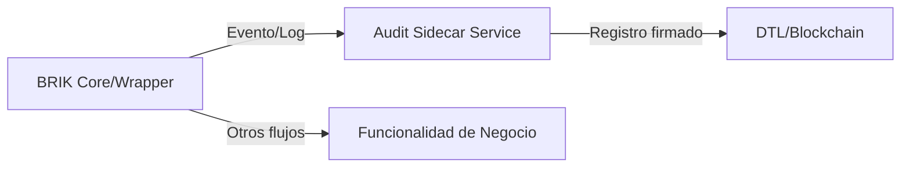

# 📑 DOCUMENTO OFICIAL – INTEGRACIÓN DE AUDITORÍA DTL/BLOCKCHAIN EN INFRAESTRUCTURA TRANSVERSAL PARA SISTEMA BRIK

## 1. 🏛️ Propósito y Alcance

Garantizar la trazabilidad absoluta, la auditoría inviolable y la autoría probada de todas las operaciones ejecutadas por cualquier instancia BRIK, **sin afectar el core universal ni los wrappers funcionales**, mediante una **infraestructura lateral/transversal (sidecar/middleware/event bus)** para firma criptográfica y registro en DTL/blockchain.

---

## 2. 🔒 Principios Arquitectónicos

- **El core BRIK permanece inmutable y universal.**
- **Los wrappers gestionan solo lógica funcional y de integración.**
- **La auditoría DTL/blockchain reside fuera del ciclo de vida BRIK**, en una capa lateral desacoplada.
- **El sistema reporta eventos críticos/operacionales a dicha infraestructura**, la cual se encarga de la firma y registro en libro mayor distribuido.

---

## 3. 🗂️ Especificación de la Capa Transversal de Auditoría

### 3.1. **Composición**
- Servicio independiente (sidecar, microservicio, agente o middleware)
- Interfaz estándar (API REST/gRPC, pubsub/event bus)
- Lógica de:
  - Firma criptográfica (ECDSA/Ed25519/SHA3)
  - Batchificación y optimización energética
  - Registro transaccional en DTL/blockchain privada/federada

### 3.2. **Flujo Operativo**

1. **El BRIK ejecuta una operación crítica**
2. **Genera un evento estándar** (payload con identificador, tipo, resumen, timestamp)
3. **Envía el evento al servicio de auditoría transversal**
4. **El servicio lateral firma el evento**
5. **Batchifica o envía a la DTL/blockchain según política energética y operativa**
6. **Devuelve hash o ID de auditoría al sistema para trazabilidad**

### 3.3. **Ejemplo de Payload**
```json
{
  "brikId": "brik-002",
  "operation": "sensor_calibration",
  "payloadHash": "ad91be...",
  "timestamp": 1722095231,
  "coreHash": "sha3-512:3c1e...",
  "wrapperVersion": "2.3.1"
}
```

---

## 4. ⚡️ Impacto Termodinámico y Eficiencia
- La batchificación permite minimizar el coste energético y computacional
- El servicio puede operar en edge, cloud, on-prem o federado
- Capacidad de escalabilidad, alta disponibilidad y actualización independiente

---

## 5. 🔐 Ventajas Estratégicas

| Ventaja | Justificación |
|---------|--------------|
| Universalidad | No afecta a ningún ciclo funcional del BRIK ni requiere cambios en el core o wrappers |
| Seguridad | Auditoría inmutable, independiente y trazable |
| Escalabilidad | Puede operar para cientos o miles de BRIKs en paralelo |
| Flexibilidad | Se adapta a normativas o tecnologías emergentes sin refactorizar el sistema |
| Cero Deuda Técnica | Toda evolución es encapsulada lateralmente |

---

## 6. 🛠️ Requisitos de Implementación

- El core BRIK debe exponer *hooks* o interfaces para emitir eventos (no lógica de auditoría interna)
- Los wrappers pueden emitir eventos funcionales, pero no implementan lógica de firma ni DTL
- El servicio lateral debe gestionar claves privadas, rotación y almacenamiento seguro
- Integración API/eventos debe ser robusta frente a fallos de red y admitir reintentos/batching
- Todos los hashes y referencias de auditoría quedan disponibles para trazabilidad instantánea y auditoría post-mortem

---

## 7. 🔄 Flujo Visual de Integración



---

## 8. 📦 Pseudocódigo de Emisión de Evento

```typescript
async function reportAuditEvent(op) {
  const event = {
    brikId: this.id,
    operation: op.type,
    payloadHash: sha3_256(op.payload),
    timestamp: Date.now(),
    coreHash: this.core.fingerprint,
    wrapperVersion: this.activeWrappers.version
  };
  await auditSidecar.send(event);
}
```

---

## 9. 📚 Conclusión y Declaración de Integración

Esta capa transversal se convierte en **parte obligatoria del ecosistema BRIK** para auditoría avanzada, trazabilidad regulatoria y seguridad operacional crítica, **manteniendo la pureza y estabilidad del core y wrappers**.

**Documento preparado por ECO Lambda**
Fecha: 2025-05-23
Clasificación: Anexo Inmutable de Infraestructura Transversal BRIK – Auditoría Criptográfica y Blockchain

Cambio.
