# 🏆 BRIK CI/CD Comprehensive Guide

**Fleet-Coordinator Documentation**: Complete guide for BRIK multi-language CI/CD pipeline with certification levels L0-L3.

## 🚀 Overview

The BRIK CI/CD system implements a progressive certification approach across Rust, TypeScript, and Python projects with four distinct quality gates:

- **L0 Basic**: ≥70% coverage + basic tests
- **L1 Lint**: ≥80% coverage + linting + type checking
- **L2 Complete**: ≥90% coverage + comprehensive CI + documentation
- **L3 Certification**: ≥100% coverage + contract tests + BRIK hash validation

## 🏗️ Architecture

### Workflow Structure

```mermaid
graph TD
    A[Push/PR] --> B[L0 Basic Tests]
    B --> C[L1 Lint + Typecheck]
    C --> D[L2 Complete CI]
    D --> E[L3 BRIK Certification]
    E --> F[Contract Tests]
    F --> G[Release Pipeline]
    
    B --> H[Coverage ≥70%]
    C --> I[Coverage ≥80%]
    D --> J[Coverage ≥90%]
    E --> K[Coverage ≥100%]
```



### Multi-Language Support

| Language   | Framework | Coverage Tool | Linter | Type Checker |
|------------|-----------|---------------|--------|-------------|
| Rust       | Cargo     | Tarpaulin     | Clippy | rustc        |
| TypeScript | npm/Jest  | Jest          | ESLint | tsc          |
| Python     | pytest    | pytest-cov   | Ruff   | mypy         |

## 📋 Workflow Details

### 1. 🦀 Rust CI/CD Pipeline (`brik-rust.yml`)

#### L0: Basic Tests (≥70% coverage)
```yaml
level-0-basic:
  runs-on: ubuntu-latest
  steps:
    - Checkout code
    - Setup Rust toolchain (stable)
    - Cache dependencies
    - Install tarpaulin
    - Run tests
    - Generate coverage report
    - Verify ≥70% coverage
    - Upload to Codecov
```

#### L1: Lint + Typecheck (≥80% coverage)
```yaml
level-1-lint:
  needs: level-0-basic
  steps:
    - Check formatting (rustfmt)
    - Run clippy linting
    - Verify ≥80% coverage
```

#### L2: Complete CI (≥90% coverage)
```yaml
level-2-complete:
  needs: level-1-lint
  strategy:
    matrix:
      rust: [stable, beta]
  steps:
    - Comprehensive tests (release + doc)
    - Generate documentation
    - Verify ≥90% coverage
```

#### L3: BRIK Certification (≥100% coverage)
```yaml
level-3-certification:
  needs: level-2-complete
  if: github.ref == 'refs/heads/main'
  steps:
    - Run contract tests
    - Generate BRIK hash
    - Final coverage report
    - BRIK certification
    - Verify ≥100% coverage
```

### 2. ⚡ TypeScript CI/CD Pipeline (`brik-ts.yml`)

#### Progressive Gates
- **L0**: Basic tests with Jest, Node.js 18+20
- **L1**: ESLint, TypeScript type checking, Prettier
- **L2**: Multi-OS testing (Ubuntu, Windows, macOS), TypeDoc generation
- **L3**: Contract tests, comprehensive coverage validation

#### Key Features
```yaml
strategy:
  matrix:
    node: [18, 20, 21]  # L2 level
    os: [ubuntu-latest, windows-latest, macos-latest]  # L2 level
```

### 3. 🐍 Python CI/CD Pipeline (`brik-py.yml`)

#### Progressive Gates
- **L0**: pytest with Python 3.10, 3.11, 3.12
- **L1**: Ruff linting, mypy type checking, Black formatting, isort
- **L2**: Multi-OS testing, Sphinx documentation, Bandit security checks
- **L3**: Contract tests, coverage validation

#### Security Integration
```yaml
- name: Security check (Bandit)
  run: |
    pip install bandit
    bandit -r src/ -f json -o bandit-report.json
```

### 4. 🚀 Release Pipeline (`release.yml`)

#### Semantic Release Process
1. **Pre-Release Validation**: Check if release is needed
2. **Semantic Release**: Generate version and changelog
3. **Post-Release Actions**: Create BRIK release artifacts

#### Release Rules
```json
{
  "releaseRules": [
    {"type": "feat", "release": "minor"},
    {"type": "fix", "release": "patch"},
    {"type": "perf", "release": "patch"},
    {"breaking": true, "release": "major"}
  ]
}
```

### 5. 🤝 Contract Tests Pipeline (`contract-tests.yml`)

#### Cross-Language Validation
- **Contract Preparation**: Detect available languages
- **Individual Validation**: Extract API contracts per language
- **Cross-Integration**: Test compatibility between languages
- **BRIK Hash Generation**: Unified project fingerprint

#### Test Matrix
```yaml
strategy:
  matrix:
    test: [
      {"from": "rust", "to": "typescript", "test_type": "api_contract"},
      {"from": "rust", "to": "python", "test_type": "api_contract"},
      {"from": "typescript", "to": "python", "test_type": "schema_contract"}
    ]
```

## 📊 Coverage Configuration

### Codecov Integration (`codecov.yml`)

#### Coverage Targets
```yaml
coverage:
  status:
    project:
      rust: {target: 90%, threshold: 2%}
      typescript: {target: 85%, threshold: 3%}
      python: {target: 88%, threshold: 2%}
```

#### Flag System
- `rust-l0`, `rust-l1`, `rust-l2`, `rust-l3`
- `typescript-l0`, `typescript-l1`, `typescript-l2`, `typescript-l3`
- `python-l0`, `python-l1`, `python-l2`, `python-l3`

### Coverage Gates by Level

| Level | Rust  | TypeScript | Python | Tests Required |
|-------|-------|------------|--------|----------------|
| L0    | ≥70% | ≥70%       | ≥70%   | Basic          |
| L1    | ≥80% | ≥80%       | ≥80%   | + Linting      |
| L2    | ≥90% | ≥90%       | ≥90%   | + Multi-OS     |
| L3    | 100%  | 100%       | 100%   | + Contracts    |

## 🔐 BRIK Hash System

### Hash Generation (`tests/contract/brik_hash.js`)

#### Multi-Language Hash
```javascript
const PROJECTS = {
  rust: { dir: 'demo-brik', extensions: ['.rs'] },
  typescript: { dir: 'demo-ts', extensions: ['.ts', '.tsx'] },
  python: { dir: 'demo-py', extensions: ['.py'] }
};
```

#### Hash Components
1. **Source Files**: All code files with consistent ordering
2. **Configuration Files**: Cargo.toml, package.json, requirements.txt
3. **BRIK Metadata**: Architecture compliance markers
4. **Git Information**: SHA, branch, tag

### Contract Testing (`tests/contract/contract_compile_all.sh`)

#### Compilation Steps
1. **Rust**: `cargo build --release --features contract-tests`
2. **TypeScript**: `npm run build` or `tsc --noEmit`
3. **Python**: Bytecode compilation + static analysis

#### Cross-Language Validation
- API schema extraction
- Interface compatibility checks
- Version synchronization validation

## 🎯 Usage Guide

### Repository Setup

1. **Copy Workflows**:
   ```bash
   cp -r .conductor/refactor-plan/.github/ .
   cp .conductor/refactor-plan/codecov.yml .
   cp -r .conductor/refactor-plan/tests/ .
   ```

2. **GitHub Secrets**:
   ```bash
   # Required secrets
   CODECOV_TOKEN=your_codecov_token
   GITHUB_TOKEN=automatic  # Provided by GitHub
   ```

3. **Permissions**:
   ```bash
   chmod +x tests/contract/contract_compile_all.sh
   chmod +x tests/contract/brik_hash.js
   ```

### Local Development

#### Run Contract Tests
```bash
# Full contract validation
./tests/contract/contract_compile_all.sh

# Generate BRIK hash
node tests/contract/brik_hash.js

# With verbose output
VERBOSE=true ./tests/contract/contract_compile_all.sh
```

#### Coverage Testing
```bash
# Rust
cd demo-brik && cargo tarpaulin --verbose --all-features

# TypeScript
cd demo-ts && npm test -- --coverage

# Python
cd demo-py && pytest --cov=src --cov-branch --cov-report=term
```

### CI/CD Triggers

#### Push Events
```yaml
on:
  push:
    branches: [ main, develop ]
    paths:
      - '**/*.rs'      # Rust files
      - '**/*.ts'      # TypeScript files
      - '**/*.py'      # Python files
```

#### Pull Request Gates
- L0 and L1 run on all PRs
- L2 runs on PRs to main
- L3 only runs after merge to main

## 🛠️ Troubleshooting

### Common Issues

#### Coverage Below Threshold
```bash
# Check specific files lacking coverage
cd demo-brik && cargo tarpaulin --verbose --skip-clean
cd demo-ts && npm test -- --coverage --verbose
cd demo-py && pytest --cov=src --cov-report=html
```

#### Contract Tests Failing
```bash
# Debug contract compilation
BRIK_TEST_MODE=contract VERBOSE=true ./tests/contract/contract_compile_all.sh

# Check generated schemas
ls -la tests/contract/schemas/
```

#### BRIK Hash Issues
```bash
# Generate with detailed output
VERBOSE=true node tests/contract/brik_hash.js

# Check file inclusion
cat .brik-detailed.json | jq '.projectHashes[].metadata.files'
```

### Performance Optimization

#### Cache Configuration
```yaml
- uses: actions/cache@v3
  with:
    path: |
      ~/.cargo/bin/
      ~/.cargo/registry/
      target/
    key: ${{ runner.os }}-cargo-${{ hashFiles('**/Cargo.lock') }}
```

#### Parallel Execution
- L0 tests run in parallel across languages
- L1-L3 run sequentially for stability
- Matrix builds optimize resource usage

## 📋 Monitoring & Metrics

### Coverage Trends
- Codecov dashboard: Language-specific trends
- GitHub status checks: Gate compliance
- Artifact reports: Detailed coverage HTML

### Release Metrics
- Semantic versioning compliance
- Release frequency tracking
- BRIK hash verification

### Contract Test Results
- Cross-language compatibility matrix
- API schema evolution tracking
- Breaking change detection

## 🎆 Advanced Configuration

### Custom Coverage Targets
```yaml
# Override in codecov.yml
coverage:
  status:
    project:
      custom_target:
        target: 95%
        paths: ["src/critical/"]
```

### Additional Languages
```yaml
# Add to contract-tests.yml
languages:
  go:
    dir: 'demo-go'
    extensions: ['.go']
    build_cmd: 'go build ./...'
```

### Custom BRIK Hash
```javascript
// Extend brik_hash.js
const CUSTOM_PROJECTS = {
  ...PROJECTS,
  new_language: {
    dir: 'demo-new',
    extensions: ['.ext']
  }
};
```

---

## 📚 Additional Resources

- [BRIK Architecture Guide](./BRIK_ARCHITECTURE.md)
- [Contributing Guidelines](../CONTRIBUTING.md)
- [Codecov Documentation](https://docs.codecov.com/)
- [GitHub Actions Documentation](https://docs.github.com/en/actions)

---

**Fleet-Coordinator CI/CD System v1.0.0**  
*Optimized for maximum strategic impact and resource efficiency*